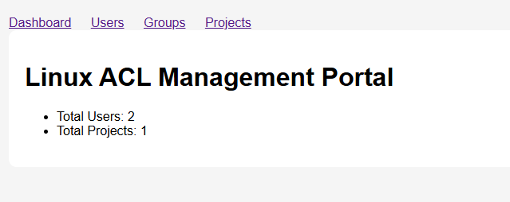
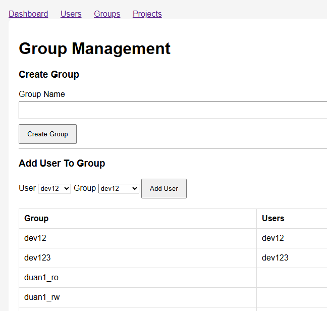
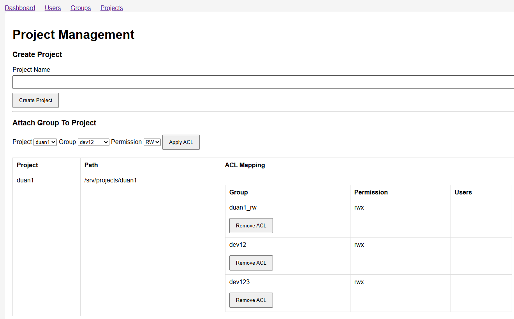
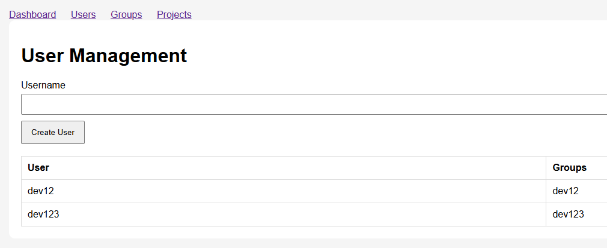

# linux-acl-portal
A lightweight web-based management portal for Linux users, groups, and filesystem ACLs, designed for multi-user development environments, code-server setups, and SMB/Samba shared project infrastructures.

# 📁 Linux ACL Project Management Portal

A lightweight web-based management portal for Linux users, groups, and filesystem ACLs, designed for multi-user development environments, code-server setups, and SMB/Samba shared project infrastructures.

It provides a simple UI to manage projects, groups, and ACL permissions directly on the Linux filesystem without relying on a database — the system reads everything in real-time from the OS.
# Screen shoot




# 🚀 Features
## 👤 User Management
List Linux system users

Detect primary and secondary groups

Assign users to groups
## 👥 Group Management

Create Linux groups

Add/remove users from groups

View group membership in real-time
## 📁 Project Management

Create project directories automatically

Attach multiple groups to a single project

Manage permissions per group:

Read Only (RO)

Read / Write / Execute (RWX)
## 🔐 ACL Engine (Core Feature)
Uses native Linux ACL (setfacl, getfacl)

Supports multiple groups per project

Default ACL inheritance for new files

Recursive permission application

Mask-aware permission handling
## 🧠 Real-Time System Source
No database required

Reads directly from:

/etc/passwd

/etc/group

filesystem ACLs
## 🏗 Architecture
```
Linux System (Source of Truth)
        ↓
Users / Groups (OS Level)
        ↓
ACL Engine (setfacl / getfacl)
        ↓
Projects (/srv/projects)
        ↓
Web Portal (Flask UI)
```
## 🔧 How It Works

When a group is attached to a project, the system automatically applies:
```
setfacl -R -m g:<group>:rwx <project_path>
setfacl -R -d -m g:<group>:rwx <project_path>
setfacl -R -m m:rwx <project_path>
```
This ensures:

Existing files receive permissions

New files inherit permissions

Group access is enforced correctly via ACL mask
## 🖥 Use Cases
Internal Dev Platforms (code-server / VS Code Web)

Multi-team development environments

Linux lab environments

DevOps internal tooling
## ⚙️ Requirements
Linux (Ubuntu/Debian recommended)

ACL support enabled:
```
apt install acl
```
Python 3.8+

Flask

## 📦 Installation
```
git clone https://github.com/dzung042/linux-acl-portal.git
cd linux-acl-portal

python3 -m venv venv
source venv/bin/activate

pip install flask
# Create folder for project
mkdir -p /srv/projects
chmod 711 /srv
chmod 711 /srv/projects
# check permission
namei -l /srv/projects
# change BASE_PROJECT_PATH in manager.py to correct folder

python3 manager.py
```
## 🌐 Access
http://localhost:5000
## 🔐 Security Model

This system relies on Linux-native security:

Users = Linux accounts

Groups = POSIX groups

Permissions = Linux ACL (not database-based)

No external authentication layer required (optional FreeIPA/LDAP support)
## 📌 Key Design Principle

“Linux filesystem is the database. ACL is the permission engine.”

## ⚠️ Important Notes
Root privileges are required for ACL operations

Do not use on untrusted multi-tenant environments without proper isolation

Always verify parent directory permissions (chmod, not ACL)